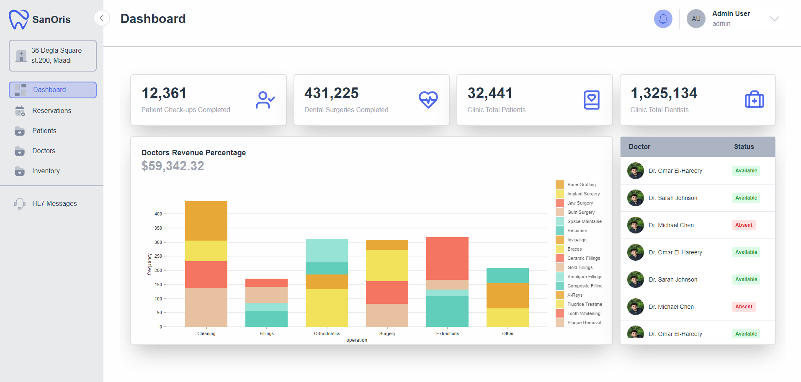
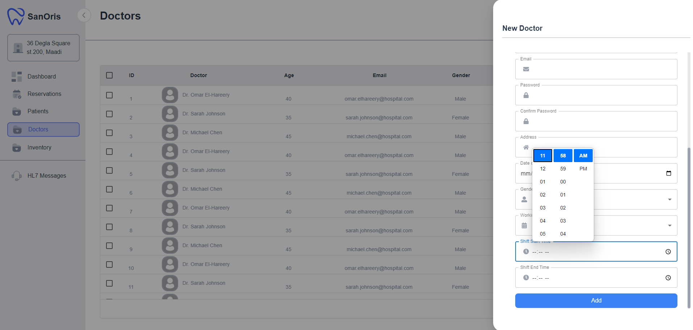
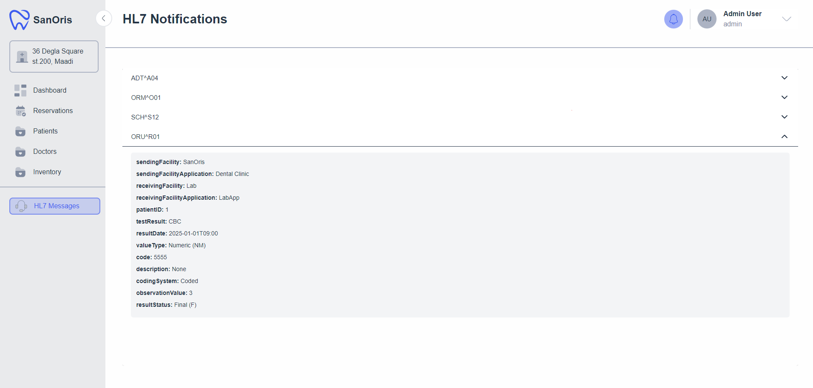
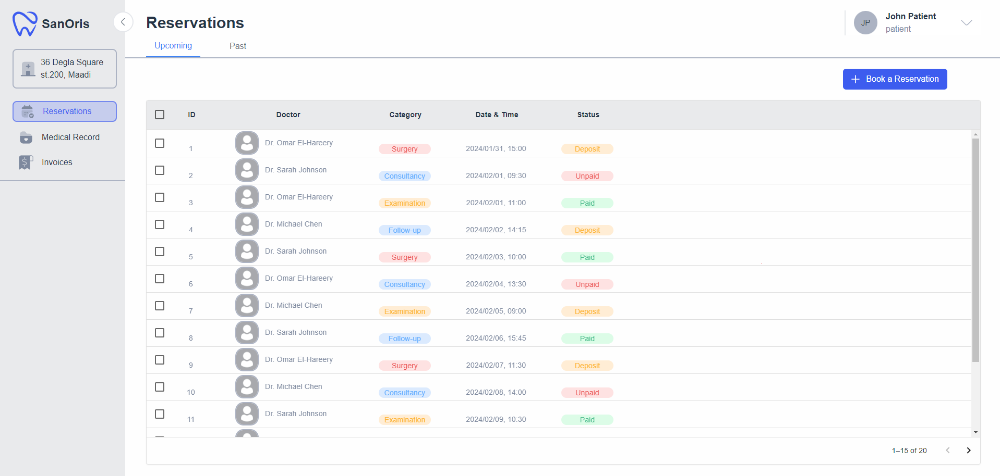
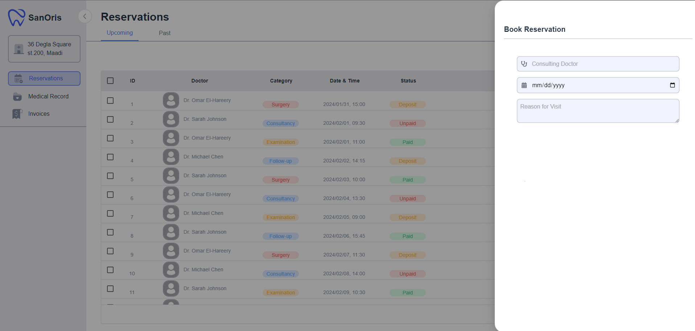
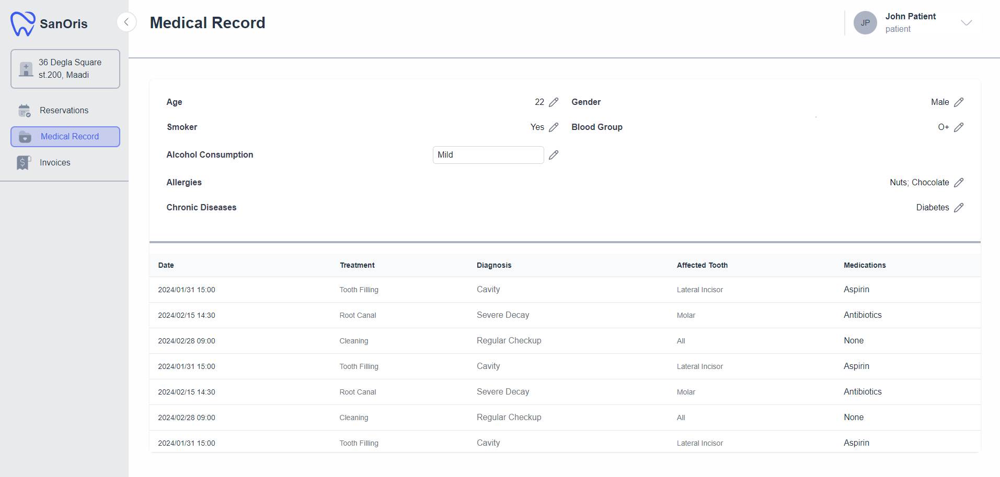
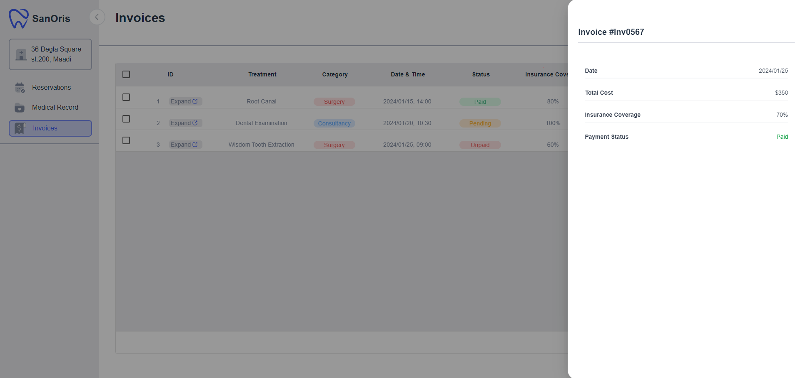
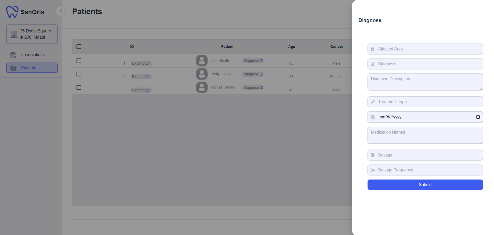

# HIS (Healthcare Information System)

Welcome to the **Healthcare Information System (HIS)** project! This system aims to streamline healthcare services by providing an efficient, user-friendly, and secure web application for managing patient and clinic information.

## Features

- **Patient Management**: Manage patient data such as personal details, medical history, and appointments.
- **Clinic Management**: Organize clinic schedules, services, and staff information.
- **Dynamic Dashboard**: Visualize and access important statistics in real-time.

## Technologies Used

This project leverages modern technologies to ensure scalability, performance, and maintainability:

### Frontend

- **Vite React**: For building a fast and modern user interface.
- **TypeScript**: For static typing and improved developer experience.
- **Zustand**: For state management.
- **Zod**: For schema validation.
- **React Hook Form**: For efficient form handling.
- **Framer Motion**: For smooth animations.
- **Axios**: For HTTP requests.

### Backend

- **Node.js**: For server-side logic.
- **Express.js**: For creating APIs.
- **MySQL**: For a relational database solution.
- **Prisma**: For database ORM and queries.
- **Aiven**: For cloud database hosting.
- **Docker**: For containerization and deployment.

## Walkthrough

### Admin

### Patient

### Doctor

